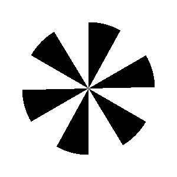
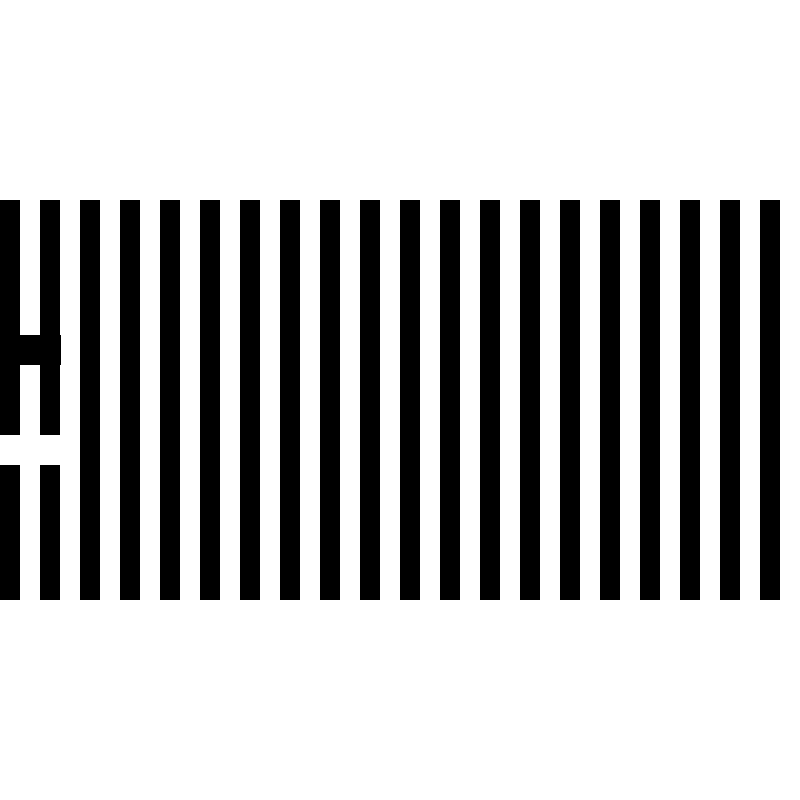
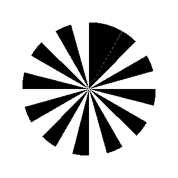
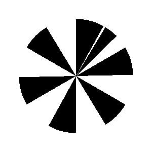

# Fan Illusions
Welcome to the repository of Lynn Chiu's master's thesis (defended in 2009 at National Taiwan University, Department of Psychology)! Supervised by Dr Suling Yeh, I explored the higher-level attention processes behind a series of "motion capture" illusions. 

What are motion capture illusions? Let's look at some DEMOS!

# Demos

The demos below consist of two "fans," each with multiple blades. 
One fan is stationary-- its blades are not moving. 

The other fan is rotating clockwise -- its blades are moving uniformaly. 

Stationary Fan             |  Moving Fan
:-------------------------:|:-------------------------:
  |  

What happens when we put the two together? 

Depending on the number of blades we have per fan, we can get two types of motion capture illusions. 

The first type: stationary blades are "captured" by moving blades and seemly move. 

 

The second type: moving blades are instead "captured" by stationary blades and seemly stop. 

# Explanation?

The second type, what I dubbed the "stop and go illusion," is a modification of the Stepping Feet illusion. Here it is in its original form. 

What is going on here? The two bars-- identical except one is black and the other white-- are actually moving in tandem at the same, uniform speed. They look like they're moving one after the other (hence "stepping" feet). That's the illusion. 

The mainstream explanation of the Stepping Feet illusion is low-level, focusing on the detection of motion signals. When the moving edges "disappear" as they move across bars of the same color, we no longer detect a moving signal and see it as stationary, even though the edges are still moving. 

I explored whether the illusion is also in part caused by higher-level attention processes. 

The reason? Motion perception is not just a matter of detecting motion signals. 

In the absence of motion signals, we can still "track" and perceive an object as moving  (e.g., when a car is moving through a tunnel or when a rolling ball is temporarily occuluded by a tree trunk). The ability to track is highly contingent on the ability to attend to the object being tracked. When there are too many objects to track, attention load or capacity is depleted and the ability to track deteriorates. 

Here's an example. In this demo, the motion capture illusion is much weaker. 

I want you to really STARE at the blade as it moves. 

Stare at the moving blade. Not the center of the fan. Think of it as a car passing through a tunnel. The car doesn't stop when it's occluded, does it? Can you perceive the moving blade as moving smoothly behind the stationary blades now?

The more focused your tracking, the smoother the blade seems to move as it transpasses the stationary blades.  

Now...

Let us compare this again to a "radial" version of the famous Stepping Feet illusion. 
.
.
Even as you stare at the moving blade, you can't help but see it as stopping-- full stop -- when its edges overlap completely with the stationary blades. 
.
.
.

In theory (according to the mainstream explanation of the Stepping Feet Illusion), in both cases motion signals were lost when the blades completely overlapped. Yet in strength of the illusion (the illusion of the moving blade stopping even when it's still moving) is clearly weaker in the first case. This means there's something more going on, more than just the lack of motion signals. 

We already know that occlusion cues are required for for proper attentive tracking. Leading and trailing edges are types of occlusion cues. I hypothesized that the above phenomena are the result of misplaced occlusion cues. 

Type 1: the leading and trailing edges of the moving blades are attributed to the stationary blades when they overlap.

Type 2: the leading and trailing edges of the moving blades disappear when they overlap with the stationary blades. 

The thesis tested whether and how adding and removing occlusion cues affected the illusion.

# More on the first type of motion capture 

The illusion is strong here: 

but decreasing the number of moving blades yields a very weak, non-existent even, illusion: 

# Fun stuff

Here's some weird demos, for fun!

 

# Scripts

The scripts are written in PsychoPy & Python3. Make sure you have psychopy library installed.

* Fan_Illusion.py: run illusions in a pop-up window. For now, adjust parameters in the script (instructions included in the documentation). 

* Download Fan_Illusion_Demo_Creator.py and gifMethods.py and run the former script to create infinite loop gif demos. 
