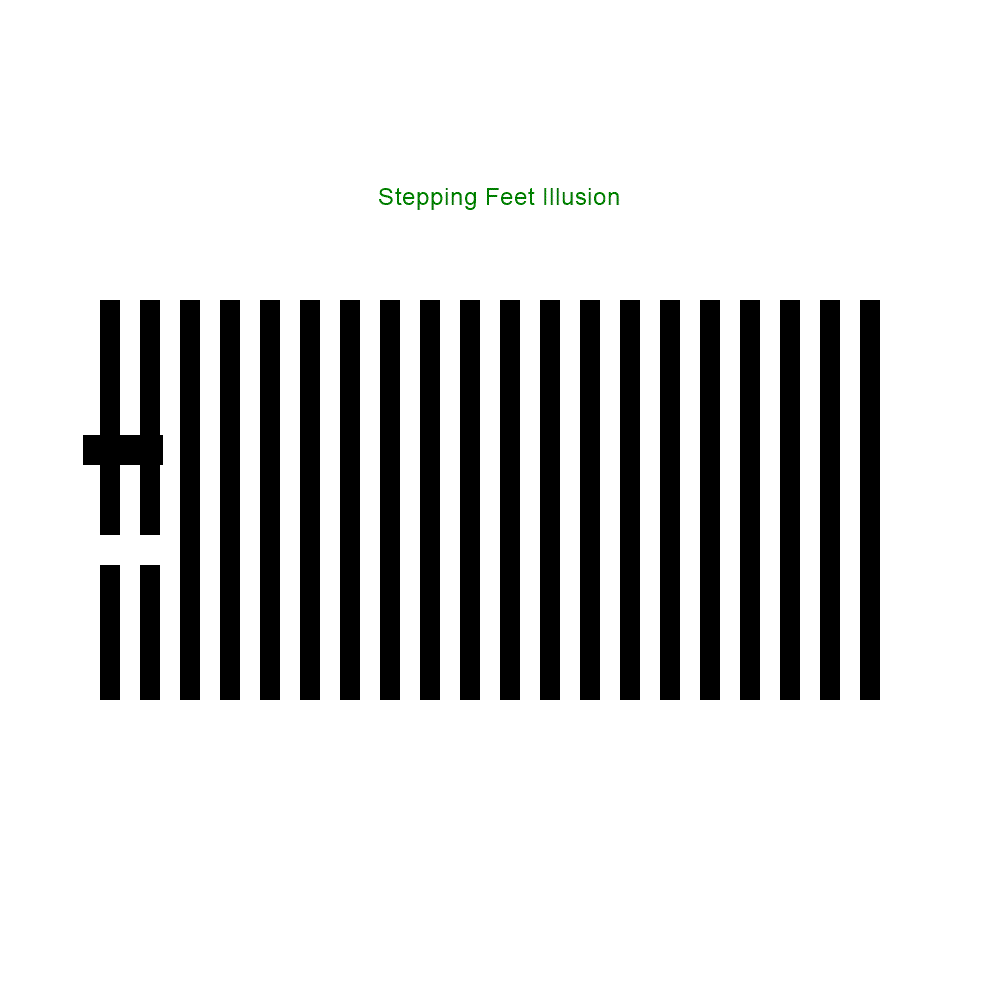

# Fan Illusions
Welcome to the repository of Lynn Chiu's master's thesis! Supervised by Dr Suling Yeh, I explored the higher-level attention processes behind a series of "motion capture" illusions. 

What are motion capture illusions? Let's look at some Demos!

# Demos

The demos below consist of two "fans," each with multiple blades. 
One fan is stationary-- its blades are not moving. 

The other fan is rotating clockwise -- its blades are moving uniformaly. 

Stationary Fan             |  Moving Fan
:-------------------------:|:-------------------------:
  |  

What happens when we put the two together? 

Depending on the number of blades we have per fan, we can get two types of motion capture illusions. 

The first type: stationary blades are "captured" by moving blades and seemly move. 

 

The second type: moving blades are instead "captured" by stationary blades and seemly stop. 

# Explanation?

The second type, what I dubbed the "stop and go illusion," is a modification of the Stepping Feet illusion. Here it is in its original.

The mainstream explanation of the Stepping Feet illusion is low-level, focusing on the presence and detection of motion signals. I explored whether the illusion is in part caused by higher-level attention processes. The reason? Motion perception is not just a matter of detecting motion signals. 

In the absence of motion signals, we can still "track" and perceive an object as moving  (e.g., when a car is moving through a tunnel or when a rolling ball is temporarily occuluded by a tree trunk). The ability to track is highly contingent on the ability to attend to the object being tracked. When there are too many objects to track, attention load or capacity is depleted and the ability to track deteriorates. 

Here's an example. In this demo, the motion capture illusion is much weaker. Stare at the blade as it moves. We seem to be able to successfully track the moving blade as it transpasses the stationary blades.  

Compare this again to the "radial" version of the famous Stepping Feet illusion. 

In theory (according to the mainstream explanation of the Stepping Feet Illusion), in both cases motion signals were lost when the blades completely overlapped. Yet in strength of the illusion (the illusion of the moving blade stopping even when it's still moving) is clearly weaker in the first case. This means there's something more going on, more than just the lack of motion signals. 

We already know that occlusion cues are required for for proper attentive tracking. Leading and trailing edges are types of occlusion cues. I hypothesized that the above phenomena are the result of misplaced occlusion cues. 

Type 1: the leading and trailing edges of the moving blades are attributed to the stationary blades when they overlap.

Type 2: the leading and trailing edges of the moving blades disappear when they overlap with the stationary blades. 

# Fun stuff

Here's some weird demos, for fun!

 

# Scripts

The scripts are written in PsychoPy & Python3. 

1. Make sure you have psychopy library installed 
2. Download all files and run Fan_Illusion.py 
